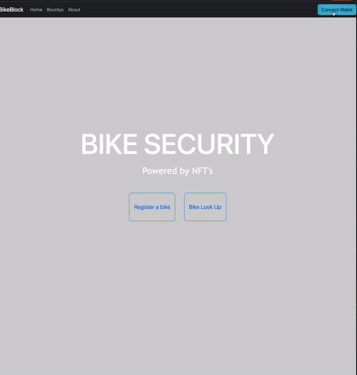

# Bike Block 

## The Motley Crüe

### Hackathon Track: Refi / SocialFi

#### Colorado, USA 

#### Team Members 

Mitchell Tucker, iOS/Smart Contract Developer 

## Project Description

Bike Block is a bike registry where anyone can register their bicycle on the Celo Network through smart contracts. Eliminating counterfeits, fraud and theft in the biking community. The decentralized registry will guarantee that the bike there are about to buy is truly owned by the seller.


## How it works.

Every modern bike has a serial number, this will be used to link bikes to a respected NFT minted during the registration process. The NFT represents the bike digitatly, containing a image of the bike with a description with other important infomation. Methods within the NFT contract will allow NFT&#x27;s to be transferred if the bike is ever sold or given, tracking the change of ownership.

Each NFT will allow a bike to be digitatly track creating an digitial footprint. Mapping serial numbers to there respected NFTs will be done through one way hashing, preventing counterfeits with the same serial numbers. 

Serial number lookup methods will allow user to lookup bikes returning the NFT for that bike. 

Owners will also have the ablility to report a stolen bike and post a reward for it location.

## Final Results

Smart Contracts
    - ERC721 
    - Utilities 
        - ERC721Enumerable
        - ERC721URIStorage
        - Pausable
        - Ownable
        - Counters

Dapps 
    - React js

Build Plan

Build plan will be split between two phases Smart Contract &amp; Dapps. Each given three weeks of build time. Contracts will need to be built first then dapp.

## Dapp DEMO

The dapp is still a work in progress. But currently allows users to connect there metamask account and safeMint a bike token. The details about there bike are including during the minting process link directly to the NFT. The hash can also be traced on the alfajores testnet.



## Finished 

1. Working smart contracts concept 
2. Full tesing of bikeBlock smart contract 
3. Deployment of smart contracts on alfajores testnet

3. Built in smart contract escrow allowing for bike bountys

    1. **Transfer funds bounty funds from token owner to contract when setting a bike stolen**
    ```js
            // BikeBlock.sol
            // Line 203-224
            function setStolenBike(uint256 tokenId,uint256 _time,Coordinate memory _location, uint256 _bountyPayOut) 
            public
            whenNotPaused
            {
                // Check if token is already set stolen
                require(!isStolen(tokenId),"State is already stolen");
                require(isTokenOwner(msg.sender,tokenId),"Not token owner");
                require(_token.allowance(msg.sender, address(this)) >= _bountyPayOut, "Insufficient allowance");
                require(_token.transferFrom(msg.sender,address(this),_bountyPayOut),"transfer Failed");

                Stolen memory stolenInfo;
                stolenInfo.time = _time;
                stolenInfo.location = _location;
                stolenInfo.bountyPayOut = _bountyPayOut;
                stolenInfo.index = stolenBikes.length;
                // Set info in stolenState 
                stolenState[tokenId] = stolenInfo; 
                bikeState[tokenId] = State.Stolen;
                // Push to stolenBikes array
                stolenBikes.push(tokenId); 
                emit Stolen(tokenId);
            }
    ```
    2. **Payout bounty funds from contract to reporter**
    ```js
            // BikeBlock.sol
            // Line 361 - 375
            function payOutBounty(uint256 tokenId,bytes32 reportId)
            public 
            {
                require(isTokenOwner(msg.sender,tokenId),"Your not bike owner");
                State state = bikeState[tokenId];
                // Check if bike is stolen 
                require(state == State.Stolen,"Bike is not stolen");
                Stolen memory stolenDetails = stolenState[tokenId]; 
                RecoveryReport memory report = recovery[reportId];
                // Transfer to reporter 
                // payout to reporter from contract
                require(_token.transfer(report.rescuers,stolenDetails.bountyPayOut),"transfer Failed");
                // Set bike state to found
                bikeState[tokenId] = State.Found;
            }

    ```


## TODO

1. Add additional functionality
    - Time locking of bounty funds (makes funds recoverable)

2. UI Design and functionality of react dapp 


# License

The project is available under [Apache licence]("/LICENSE")