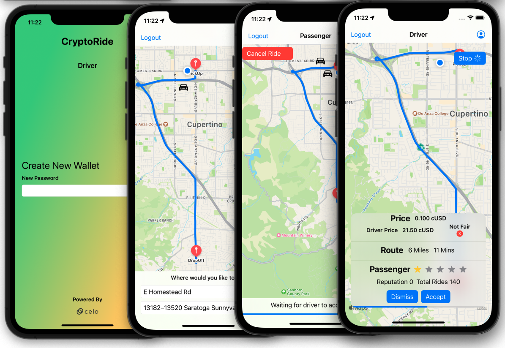
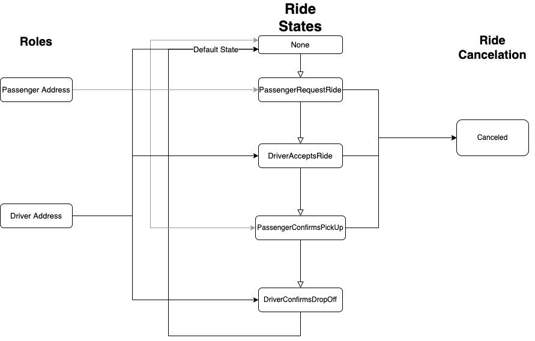
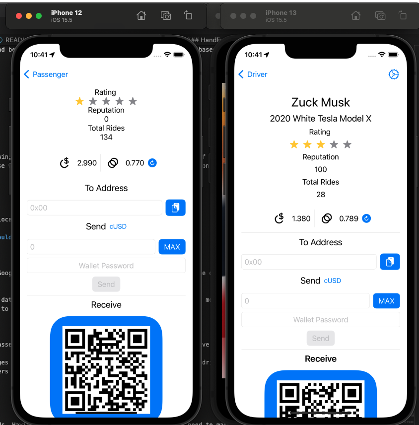

# Crypto Ride

  * [Team](#the-motley-crüe)
  * [Project Description](#project-description)
  * [Challenges](#challenges)
  * [Celo Network](#why-on-the-celo-network)
  * [Quick Start](#quick-start)
    + [Requirements](#requirements)
    + [Video Demo](#video-demo)
    + [Contract Deployment](#1-download-and-install)
        * [Compiling](#1-compiling)
        * [Migrating](#2-migrating)
    + [iOS Dapp](#ios-dapp)
        * [Download & Install](#1-download-and-install)
        * [Building & Launch Simulator](#2-building-and-launch-simulator)
  * [Contract Overview](#contract-overview)
    + [Escrow](#escrow)
    + [Ride cancellation](#ride-cancellation)
  * [iOS Overview](#ios-overview)
    + [Drivers locations](#drivers-locations)
    + [Wallet](#wallet)
    + [Handling Events](#handling-events )
  * [Licence](#licence)

---

## The Motley Crüe

### Hackathon Track: Refi

#### Colorado, USA 

#### Team Members 

Mitchell Tucker, iOS/Smart Contract Developer 

## Project Description

 Introducing Crypto ride, a new way to spend and earn cryptocurrecy while reducing traffic and pollution. Crypto ride upgrades the traditional ride share architecture into the world of web3. Rides will be managed and controlled by smart contracts hosted on the Celo network. Tapping into a multi billion dollar industry run by Uber and Lift. These companys control 99% of all ride sharing services (USA) taking a 30% fee or more from drivers. Crypto ride's decentralized architecture powered with the Celo Network would reduces fees and revolutionizes the ride share industry.
 
 
[Check out the projected grow rate.](https://policyadvice.net/insurance/insights/ride-sharing-industry-statistics/#:~:text=How%20big%20is%20the%20ride,around%20%24220%20billion%20by%202025.)

### Challenges

<b>Geo based matching of passengers to local drivers.</b>

When a driver is actively looking for rides there location will be broad cast and updated to Google Firebase. As using a smart contract for location services would be to costly. From the passenger app we use the drivers locations to identify who is in the same proximity to the passenger location. Passenger will get a list of local drivers and there details, including rates,identities and work radius. Passenger can select what driver and fare they want priorities.

<b>Calculating the fare estimates & keeping far market value.</b>

The driver would be responsible for setting there rates, the rate would be used to create a fare estimate. Passenger can change the fare estimate to what they think is reasonable. This is simular to how mining fees are processed. If you set your fare estimate too low no driver is willing to accept the ride. While setting your fare estimate too high you will get a driver faster, but at a risk of over paying. This would create competition between drivers and passengers keeping far market value.

<b>Driver receiving & accepting a ride.</b>

Newly created rides would be emitted on the network along with payment of the ride. Drivers will listen for relevant events, if the driver doesn't accept or is slow to accept the ride. The ride will be offered to the next best driver. If no driver accepts the ride, the ride will be canceled with the payment returning back to the ride creator.

<b>Spliting the cost between passengers.</b>

When a passenger builds a ride they will be able to opt-in for ride sharing. If an existing ride that has has ride sharing enabled is within the same proximity and approximate destination the second passenger can submit a pickup. This will notify the driver with the updated ride. The ride cost will be split between when the second passenger is picked up and dropped off. The fare estimate would be locked in at what the first passenger agreed to.

<b>Preventing bad actors in both roles (Driver & Passenger).</b>

Use star rating and reputation system for both passenger and driver. Both roles will gain reputaion for completed rides and lose reputaion for canceling rides when it goes against policy. If a ride is canceled the user with the most reputation will be favored for how the cancellation fee would be executed.

<b>Safe for everyone to use. </b>

Adding [identities](https://docs.celo.org/protocol/identity) could mitigate the risk assocated with ride sharing.
    Utilizing different social media plateforms a passenger could quickly profile a driver. 

### Why on the Celo network?

- The Celo Network is optimized for mobile clients making Celo the perfect network for mobile driven dapps like Crypto Ride. Crypto Ride could in future support light clients to help internalize request for account and transaction data. Plumo Ultralight Sync.

### What is needed?

- Smart Contracts

    - Ride share contract
        - Controls and manages the ride state.
        - Rating and reputation.

    - Escrow contract

        - Used as the trusted third party between passenger and driver. 

        This allows for more flexibility on how the funds are transferred based on the outcome of the requested ride ie cancellations.

    - Token contracts

        - Used as payment for the ride service. 
        
        - Celo's cUSD stable token.
        

- Mobile Apps

    Two separate apps for each role. 

    - Passenger
        - Can request a ride with when and where.
        - Get active driver location and fare estimates. 

    - Driver 
        - Ability to accept & manage a ride
        - Stats on earnings
        - Geo location of work area 

- Google Firebase 

    Some aspects of the Crypta Ride would need to be centralized as they are too costly to be implmented in a smart contract. 

    - Driver location-tracking
  

### Who would use this?

There would be two different user types. Users who want to earn and those who need a ride.

- Drivers earn crypto for there ride services. They would have the ability to set there own rates. Giving them the power of what there time is worth.

- Passengers spend crypto on a real world services without the need to transfer into native currency.

#### Summary

The most basic functionality of this project is just a smart contract with an app. Smart contract handles the ride states and payment, while the app allows the passenger and driver to facilitate there roles.

<b> Critical Features </b>

- Geo base grouping of passengers to local drivers.
- Location tracking for active drivers.
- Handling of ride cancellations.
- Passenger and Driver rating & reputation.
- Driver identities.

<b>Additional features could be added making the experance more familiar to existing ride sharing. </b>

- Driver rewards for good reputation
- Direct messaging between passenger and driver
- Tipping

## Presentation

<b>Ride Architecture</b>

Simply the ride has four steps from start to finish, anywhere within the ride is cancellable by either party. The contract keeps track of the steps by using 6 different ride states. These states cannot be skipped and only called from the correct party. Here are some important topics for each state.

- <b>None</b>
    - Default state for all new address.

- <b>Passenger Announced Ride</b>

    - Passenger requests a ride and is waiting for a driver to accept.
    - When the request is made, passenger sends price of ride which gets held by the escrow contract.

- <b>Driver Accepts Ride</b>

    - Driver has accept the ride and is waiting for passenger to confirm picked up.
    - When the driver accepts the ride, passenger is notified the ride was accepted.

- <b>Passenger Confirms Pick Up</b>

    - Passenger confirms pick up and is waiting to be dropped off by driver.

- <b>Driver Confirms Drop Off</b>

    - Driver confirms dropping passenger off.
    - Driver gets paid out from the escrow contract.
    
    - Passenger will be request to rate the driver.
    - Driver and passenger reputation will be increased.

    - Ride complete.
    
- <b>Canceled</b>
    - Ride has been canceled.
    - Reputation might be decreased for the party responsible for cancelling.
    

## Quick Start

### Requirements

- Git 

- Contract (Optional)

     - Truffle v5.5.29 (core: 5.5.29)
     - Ganache v7.4.0
     - Solidity 0.8.9 (solc-js)
     - Node v16.17.0
     - Web3.js v1.7.4

- iOS Dapps
     - macOS
     - Xcode Version 13.4.1
     - Target iOS 15.5
     - [Cocoa Pods 1.11.3](cocoapods.org) or greater

---

### Video Demo

The first part of the [demo video](https://youtu.be/I6XcnBkmJtY) also walk-throughs the quick start guide. 

### Contract Deployment (Optional)

By default the iOS dapps use a pre-deployed ride manager contract on the Alfajores Testnet.

#### Download and Install

1. Open your terminal and git clone the project repo.

        git clone -b Crypto-Ride https://github.com/MitchTODO/build-with-celo-hackathon.git

2. `cd` into the smart contract selection of the project and install npm libraries.

        cd build-with-celo-hackathon/Crypto-Ride/SmartContracts

   Install npm libraries with the following command

        npm install 

#### Compiling 

1. With the same terminal run truffle compile to build the smart contracts.

        truffle compile

   This will create a build folder containing the important contract details.

#### Migrating / Deploying

Depending on what network you are deploying to, your settings will be different. This readme will walk through on deploying to Alfajores Testnet.

You will need a wallet funded with CELO and access to the private key. 

1. Launch Metamask to generate a new wallet. This wallet will act as the contract owner.

2. Copy your address and navigate over to [Alfajores Testnet faucet](https://celo.org/developers/faucet) to fund your wallet.

3. Within Metamask go to wallet details and copy the private key. Paste your private key in the truffle config file on line 79.

4. With the terminal run the truffle migration command with the network options set to `testnet`.

        truffle migrate --network testnet

***Keep your terminal open you will need the output from the migrate command***

### iOS Dapps

#### Download and Install

1. If you havn't already lunch the terminal & git clone the project repo. 

        git clone -b Crypto-Ride https://github.com/MitchTODO/build-with-celo-hackathon.git

2. With the same terminal cd into driver app.

        cd Hackathon/build-with-celo-hackathon/Crypto-Ride/iOS/CryptoRide-Driver

3. Run the following command to install the Pod libraries.

    ***Note: This process will need to be done for both dapps***

        pod install 

    **If your running on M1 chip use**

        arch -x86_64 pod install

#### Building and Launch Simulator 

If you are using your own ride manager contract change the address in the dapps to your ride manager address created during migration.

   ***Note: This process will need to be done for both dapps***

1. Open Xcode and select `Open a project or file` then navigate and open driver's workspace file.

    `Crypto-Ride -> iOS -> CryptoRide-Driver -> CryptoRide-Driver.xcworkspace`

2. Select a iOS Simulator and build the App.

    ***Note: You might need to change your siging & Capabilities***

Continue to the [Dapp walk through](https://youtu.be/I6XcnBkmJtY).

---

## Contract Overview

  The ride manager contract inherits three other contracts `ReputationManager`, `AdminControls` and `DriverRole`. With numerous utility contracts within.

  -<b>ReputationManager: </b> Enforces a reputation system for passengers and drivers, based on different out comes of a ride. 

  -<b>AdminControls: </b> Adjustable settings within the ride manager contract. Only callable by the contract owner.

  -<b>DriverRole: </b> Registration contract for drivers.

### Escrow

  Escrow component is built into the ride share architecture of the ride manager contract. Before a passenger announces a ride, they must approve the ride price from the token contract that will be used as payment. This in turn grants the escrow to transfer funds on behive of the passenger. Funds are held until one of two events. 

  - No drivers accept the ride. Forcing the passenger to cancel and resubmit, in which funds are returned.

  - Driver accepts and completes the ride, having the escrow payout the driver upon passenger drop off.

### Ride cancellation

Ride cancellation is allowed by both partys from when the ride is announced and before passenger confirms drop off. Funds are divide based on ride state, preventing bad actors. 

<b>Return Amount</b>

|  Ride State      | Passenger | Driver |
|------------------|-----------|--------|
| Announced        | 100%      | 0%     |
| Driver Accept    | 80%        | 20%   |
| Passenger Pickup | 50%        | 50%     |
| Driver DropOff   | 20%        | 80%     |

As the ride progresses the potental for bad acting favors the passenger. Allowing a passenger to cancel the ride at the drop of location with the result of lower price. To further prevent this, cancellations by either party will result in a rating decrease while decreseing reputation to the indivial who cancelled.

## iOS Overview

App architecture is desgin around Apple's `MapView`, views presented around the map are switch depending on different states. Core features between apps are very simular but views are different. Passenger is required to build rides and selected different aspects of the ride. While driver is design to wait and react for rides announced on the network. 

### Drivers locations

Googles Firebase and Realtime databases are used to orchestrate discovery and location of drivers.

**Note conventional databases are used for locations services as blockchain would be to costly.**

<b>Driver</b>

1. When a driver is ready to listen for new rides, they will post an entry to Googles Firebase. Entry contains information related to the driver (name, car details, ethereum wallet and city). As well as a geohash used for queries by passengers.

2. Driver will then start updating there current location to Googles Realtime database. This update will only occure if the driver has moved far enough away from there previous location and three seconds have elapsed. There location is mapped to there ethereum address.

*Upon logout/stop driver app will delete both Firebase and Realtime entries.*

<b>Passenger</b>

1. Upon launch the passengers app will query Firebase with a geoHash of the passengers currently location. This query will return active local drivers. 

2. Passenger app will then use the drivers ethereum address to observing changes to the Realtime database for the current location of driver. These changes driectly updates the `mapView` displaying the drivers location close to realtime. Drivers are repersented as cars on the passengers map view.

**Note newly active drivers take around 10 seconds to be add to the passengers map**

*By observing deletions drivers are removed*

---

### Wallet

Both passenger and driver apps have hot wallets designs for low amount of funds. Having the idea that you only tranfer the funds you need to make a ride then return the remaining amount back to cold storage. Users private key is saved to there Apple keychain providing a recovery mechanism for users. As of now only the driver role requires registration requiring a name, vehicle description and social profiles linked to the wallet address. 

Wallet currently features two tokens `CELO` and `cUSD`.

- Celo: Used to pay for the transaction cost associated with writing to the contract. 

- cUSD: Used as payment for the ride. 

This was needed as the `web3swift` library is restrictive when it comes to transaction options. Preventing `cUSD` from being used to pay transaction cost featured by the Celo Network. This will most definitely will be fix in a future update.  

---

### Handling Events 

Listening to contract events is a integral part of the app. Events are received by subscribing to a web socket provider and filtered on relevance to the current user. Events can force changes to the ride state allow for the progression and completion of a ride.

When a passenger announces a ride, driver will received an event. The event is check and if relevant to the driver, driver then has a 30 second window to view and accept the ride. If time elapses the ride will be dismissed and prop the next driver to accept the ride.

## Licence

Crypto Ride is licensed under the [Apache License 2.0](https://github.com/MitchTODO/build-with-celo-hackathon/blob/main/LICENSE)
