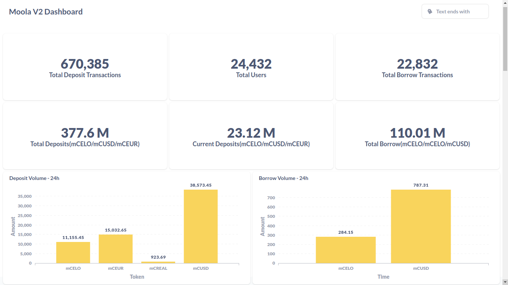
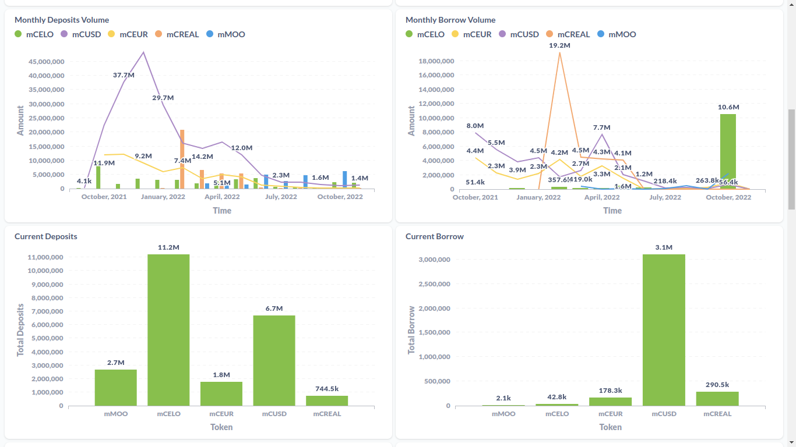
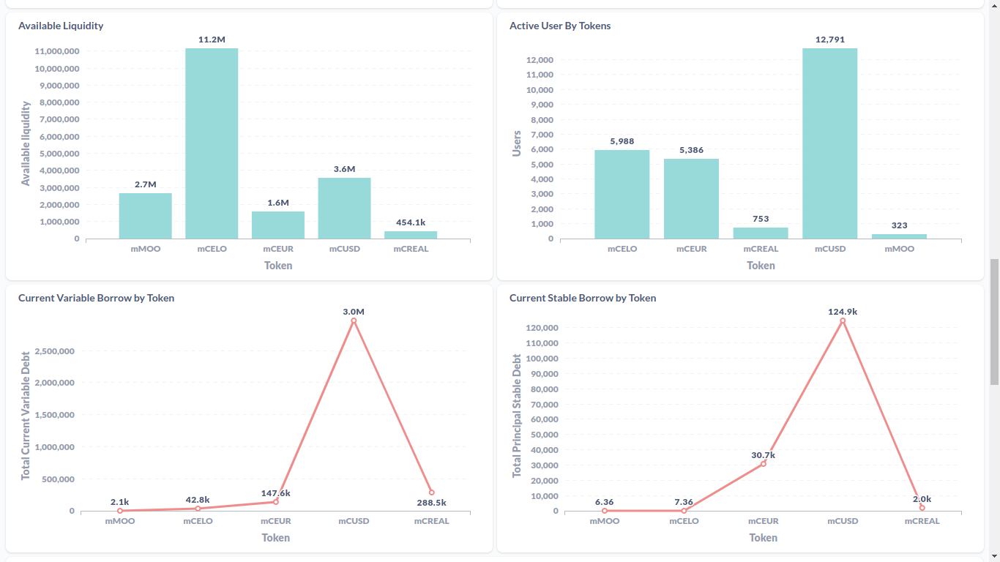

## Project Name
### Moola v2 Dashboard :chart_with_upwards_trend: :bar_chart:

#### Hackathon Track
##### DeFi (ReFi)

##### Region location
##### Indore, India

##### Team Members
- Hitesh, Blockchain and Data Engineer

#### Project Description
The Moola v2 Dashboard is a analytics dashboard for the Moola money market. The moola market will become more understandable to users through this dashboard and we will be able to track and monitor the deposits, borrowings, liquidity, etc. of mMOO, mCELO, mCEUR, mCUSD, and mCREAL tokens with the help of historical data charts.
##### About the used tech
- DappLooker: Blockchain analytics and visualization platform for dashboard
- SQL for creating charts
- TheGraph: to create and host **Moola market v2 subgraph**
- Typescript to implementation of subgraph

#### Summary
With Moola v2 Dashboard user can keep eye on current market stats and Historical data charts will allow users to track and Monitor Moola Market v2 Growth metrics and deposits, borrowings, liquidity, etc. of mMOO, mCELO, mCEUR, mCUSD, and mCREAL tokens.
Belows are the various charts which are added in th dashboard to view moola market stats:

:1234: **Number Charts:** 
- Total Users
- Total Deposit Transactions
- Total Borrow Transactions
- Total Deposits(mCELO/mCUSD/mCEUR)
- Current Deposits(mCELO/mCUSD/mCEUR)
- Total Borrow(mCELO/mCELO/mCUSD)

:chart: **Combo (Bar+Line) Charts:**
- Monthly Deposits Volume
- Monthly Borrow Volume

:bar_chart: **Bar Charts:**
- Deposit Volume - 24h
- Borrow Volume - 24h
- Current Deposits
- Current Borrow
- Available Liquidity
- Active User By Tokens

:chart_with_upwards_trend: **Line Charts:**
- Current Variable Borrow by Token
- Current Stable Borrow by Token

##### Dashboard Screens

#### URLs
Moola v2 Dashboard: 
[**Dashboard link**](https://dapplooker.com/dapp/moola-v2-120062?network=celo&type=dashboard&udid=0)

#### Presentation
See the screens added in summary of follow :point_right: [**link**](https://dapplooker.com/dapp/moola-v2-120062?network=celo&type=dashboard&udid=0)

#### License
This repository includes an [unlicensed](http://unlicense.org/) statement though you may want to [choose a different license](https://choosealicense.com/).
