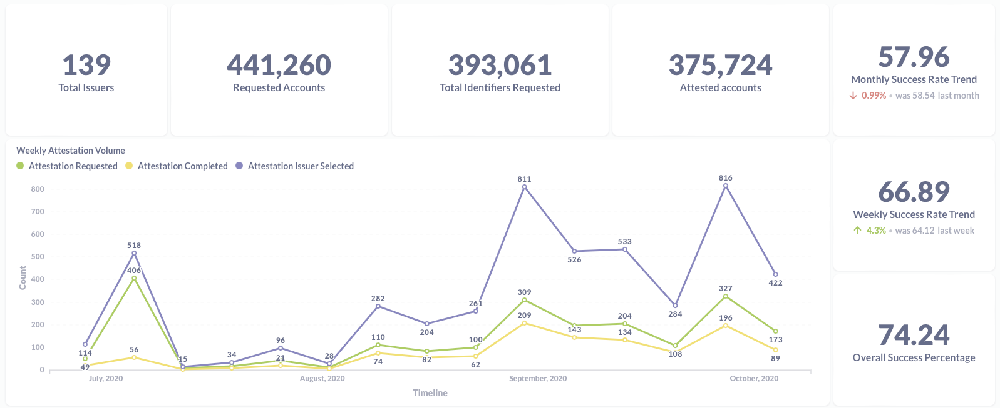
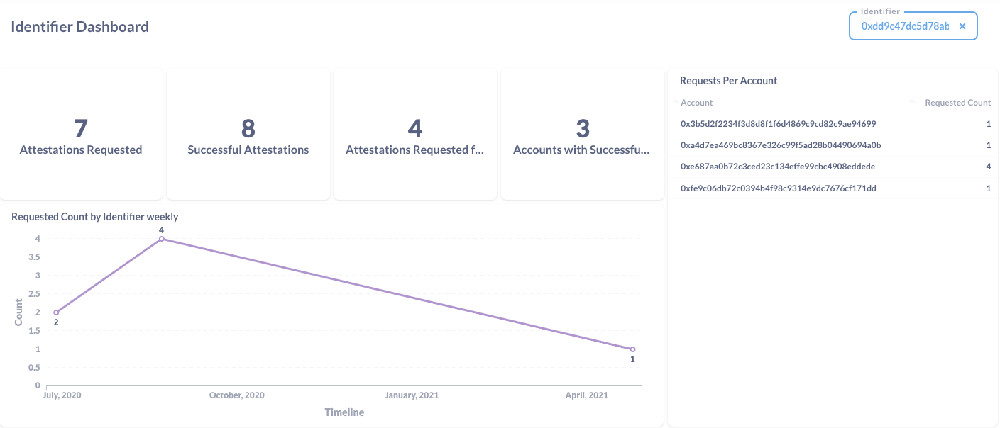
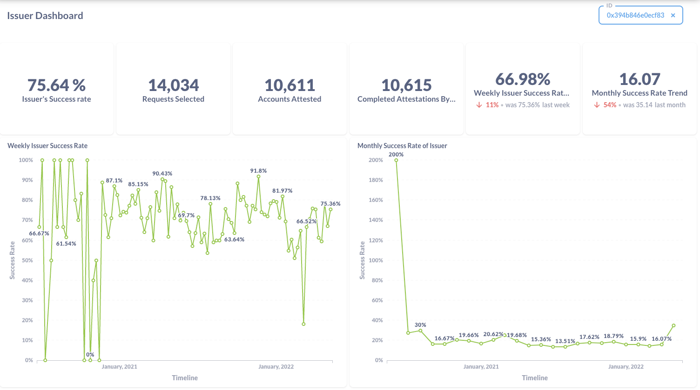

# ⚡ Hackathon Project Template ⚡
_This is a sample submission repository.
Please [__fork this repo__](https://help.github.com/articles/fork-a-repo/) and use this as a starting point for your hackathon project._

# Project Name
Celo Attestation Dashboard

### Region location
Bangalore, India

### Project Description
Analytics dashboard on celo attestation process, which will help us understanding attestation process with data.

### Tech-Stack
- DappLooker: Platform DappLooker used for creating the charts and dashboard
- SubGraph: subgraph creation on thegraph platform
- Javascript
- SQL for creating charts on DappLooker platform

### Summary
Before understanding the project we need a short understand of Celo attestation service, which is used for verification of phone number on chain. Subgraph is indexing transactions data of Attestation contracts.  Subgraph help understand attestation success rate and gas involved in the process. Subgraph is then registered at DappLooker platform to display metrics and KPIs.

I have created various charts which will help us to understand the attestation stats. Below are the details 
#### Attestation Dashboard
**Number chart**
- Total Issuers
- Total Requested Accounts from various identifiers
- Total Identifiers who have requested for any attestations
- Total accounts attested till date
- Overall success percentage, which means overall requested and succeeded attestations
- Monthly and Weekly success rate trend

**Table chart**
- Issuers success rate with top and bottom 10
- Identifiers requested count.

**Line chart**
- Weekly/Monthly/Quarterly Attestation volumes
- Weekly/Monthly over all success rate
- Weekly/Monthly Gas Consumed

**Below is the sample screenshot**

#### Identifier Dashboard
This dashboard includes details related to particular Identifiers. We can give identifier address and it will show details like below images. Metrics included are:

- Attestation Requested
- Successful Attestations count
- Count of Attestation requested for Account
- Accounts count which are successfully attested
- Request made by Identifier per account
- **Line chart:** Which shows weekly attestation requests

#### Issuer details Dashboard

This dashboard contains details about Issuer. Input for dashboard is Issuer address. Following metrics are included here:

- Issuer success rate, which basically shows rate on which issuer able to attest the request
- Requests Selected, total number of time Issuer is been selected
- Account Attested, which shows count of Attested account
- Completed Attestation, which show count of all attestation completed by Issuer
- **2 Trend chart**, which shows its trend over weekly/monthly success rate
- **Line chart,** Shows weekly and monthly success rate.

### URLs
**Attestation dashboard:**
- [**Dashboard link**](https://dapplooker.com/dapp/celo-attestation-120131?network=celo&category=celo&type=dashboard&udid=0)

**Identifier dashboard:**
- [**Dashboard link**](https://dapplooker.com/dapp/attestation-identifier-120149?network=celo&category=celo&type=dashboard&udid=0)

**Issuer dashboard:**
- [**Dashboard link**](https://dapplooker.com/dapp/celo-all-tokens-120082?network=celo&category=celo&type=dashboard&udid=0)

### Presentation
Shared in summary.

### License
This repository includes an [unlicensed](http://unlicense.org/) statement though you may want to [choose a different license](https://choosealicense.com/).
