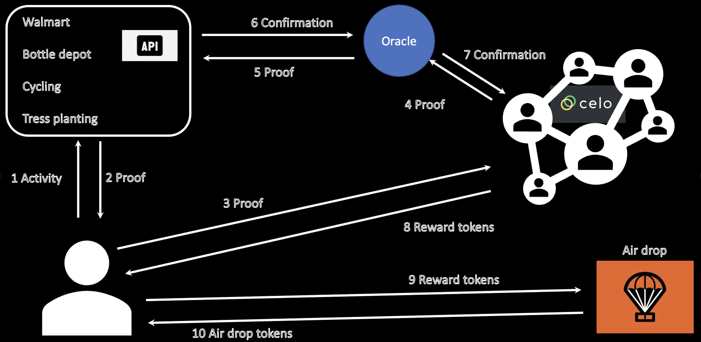

## ⚡ SUStainability Tokens (SUST): Everyone's Crypto ⚡

### Team name
Catalyst Technologies Ltd
#### Hackathon Track
DeFi (ReFi) - Public Good
##### Region location
Calgary, Canada
##### Team Members
- Muni V K, Blockchain Developer, Catalyst Technologies Ltd.

#### Project Description
Aligning with Celo’s mission to enable a financial system that creates the conditions for prosperity and bring the benefits of digital assets to all, our goal is to recognize and reward both crypto and non-crypto savvy individuals, for their regenerative behaviour and practices for the prosperity of a healthy planet.

The aim of our project is to create a global regenerative economy by providing equal opportunity for every individual on the planet to get incentives from the new crypto market initiatives such as airdrops. The incentives encourage the individuals to adopt and/or continue sustainable practices to preserve and restore natural habituate of the planet. 
For example, we create opportunities for individuals (called users hereafter) to get continuous crypto incentives for their sustainable practices like, when they use their own reusable bags or at the least not to buy new bags (especially plastic) when they do shopping (e.g., grocery shopping at a Walmart), when they recycle (e.g., depositing recycling plastic with a bottle depot), when they participate in a community sustainable projects (e.g., ocean cleanup organized by NGOs), clean and green energy initiative (e.g., installing solar power system), etc. 

#### Summary
To aligning with Celo’s mission of bringing the benefits of digital assets to all by removing systemic inequalities, we propose to tokenize sustainability behaviours and efforts to reward the individuals exercising the regenerative behaviour. 
For example, let us take the example of using reusable bags or avoiding plastic bags usage while shopping. Users who exercise this sustainability behaviour will be issued a specific ERC20 token, called SUStainability Token (SUST), on Celo platform. SUST holders are given preference when new crypto projects are launched and opt to distribute their tokens out to the greater population through airdrops. Higher the number of token holdings higher the priority during the airdrops. 

#### How to run the project
- Step 1 : Clone the repo
- Step 2 : Make sure you have Node installed
- Step 3 : Open the terminal and navigate to the "frontend" folder
- Step 4 : run the command "npm install"
- Step 5 : run the command "npm start"
- Step 6 : Open a web browser and type localhost:3000 and enter
- Step 7 : Have fun with the UI

#### URLs
Check this video for the sample execution of the project: 
https://youtube.com/playlist?list=PLi6LaqPTG8nZ1y17BvBlvLYjX__5BuRZ3

#### System design

#### License
This repository includes an [unlicensed](http://unlicense.org/) statement though you may want to [choose a different license](https://choosealicense.com/).
