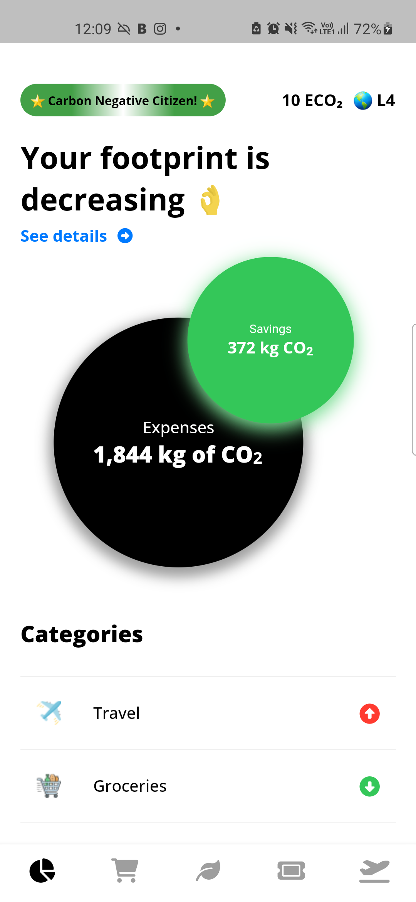
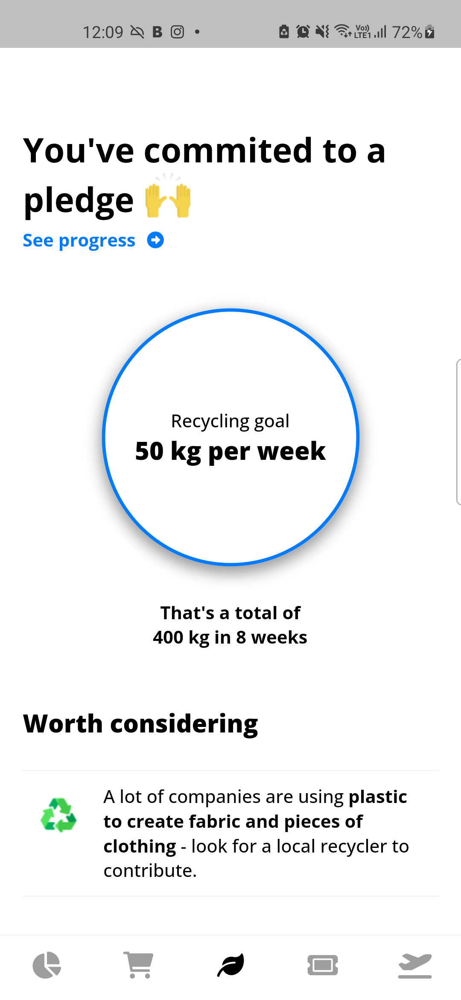
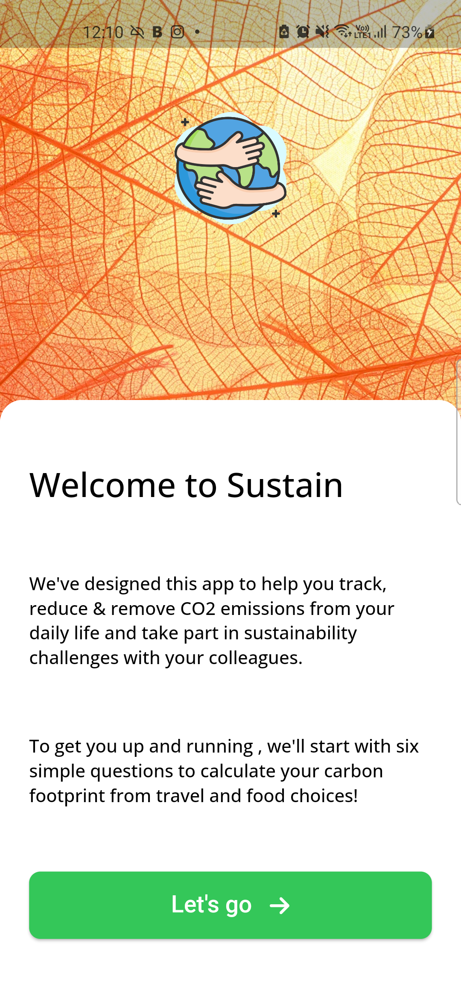
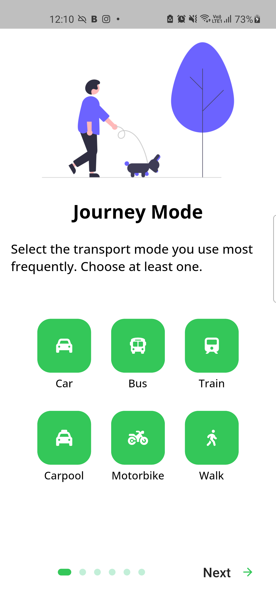
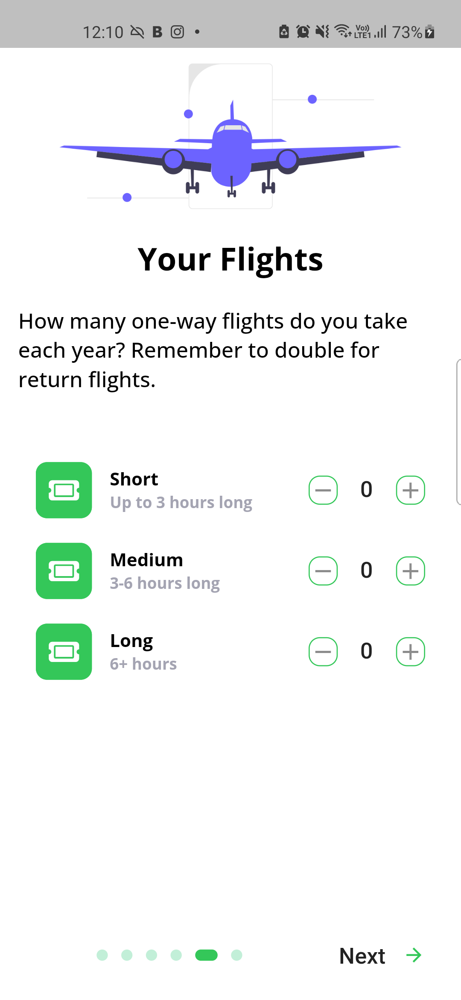
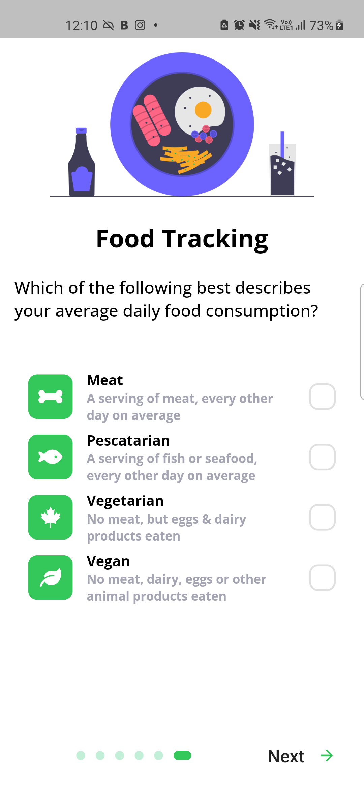
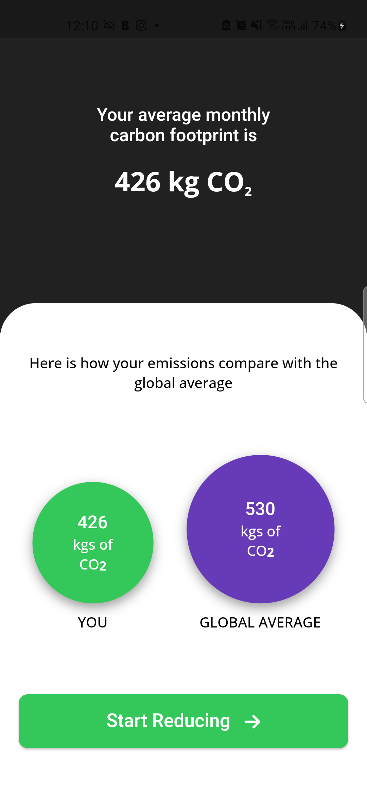

## The Earth Protocol

The Earth Protocol aims to become the world's largest consumer product and tooling platform for all solutions required to solve climate and other crises on Earth by using the latest cutting-edge technology such as Machine learning and Blockchain. We hope to collaborate, coordinate, and help the most significant organizations working towards the exact cause positively impact every corner of the earth.

### Team members

Sameer Kashyap - Full stack developer

Hackathon track

### Project details

[**Website**](https://dull-espadrille-18d.notion.site/The-Earth-Protocol-01d1206f5cd64dd880a8496a70a14236)

The earth protocol is an open suite of consumer and business products that will help combat climate change, the flagship product is an app called Sustain, a consumer-based application that helps individuals with a range of tools and opportunities to reduce their carbon footprint hence helping slow down climate change.

The Sustain app helps incentivize users for building sustainbale habits and actively contirbuting to fight against climate change. It will use Refi to help form a cycle to achieve net zero emissions in most regions. The earth protocol will implement a smart contract that will help regulate and facilitate the voluntary carbon market.

It will also have a lot of other focus areas like collaborations with other protocols for enhancing user experience as well as focus on research and development for better usecases for industries.

The Earth protocol will incorporate core concepts of Refi, NFTs and DAOs to build an ecosystem of tools and solutinos focued on solving climate change using Celo's carbon negative blockchain.

Raodmap

Phase 1

- Move supply chain of products on chain
- Build more features into the MVP
- Research more into buidling other technoclogial integrations

Phase 2

- Colloborate with Plastiks and Flywallet to integrate their services.
- Build community and DAO for incentivizing contributions

Phase 3

- Take part in Celo Camp
- Iterate, build and perfefct the product
- Launch to market

<pre>
  &nbsp;    &nbsp;    &nbsp;    &nbsp;    &nbsp;    &nbsp;   
</pre>
